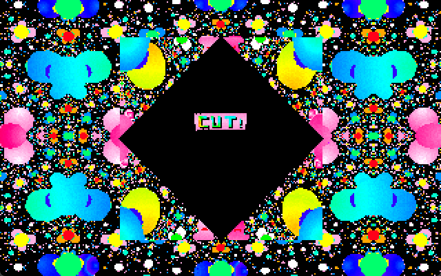
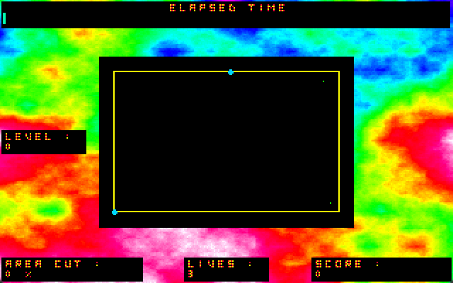

# Cut!

Welcome to Cut!, a Volfied remake coded in Pascal.

It was developed in 1995. The only memories I have about the development is that I spent some weeks during the summer vacation working on it at my father's former work place - I remember trying to implement and optimize the intro (which, given how slow is the end result, seems that I was not succesful ;) )

As it was customary for the games of that time, a separate SETSOUND app is provided to configure the sound.

The game has a bunch of issues, namely:
* intro is insanely slow
* menu keyboard input is wonky
* filling an area has a noticeable freeze
* sound might not work (not sure if the original coding doesn't emulate well or it's a matter of setup)

For a similar game, try [Don't Worry](https://www.pirongames.com/dont-worry/), which I've developed for web browsers in 2018.

## Gameplay Instructions

Use keyboard to move. Avoid being hit by the chaser and avoid the bouncers hitting incomplete lines. Fill over 90% to complete a level.

## Media

## License

Code license:
https://opensource.org/licenses/MIT

## Setup&Install&Build (original)

Requirements:
* build: Turbo Pascal/Borland Pascal
* run: MS-DOS or emulation (DOSBox, FreeDOS)

Try to run SETSOUND.EXE first to configure the sound. If using DOSBox, try changing sbtype to sb2 if there is no music (or configure the sound for the PC speaker)
